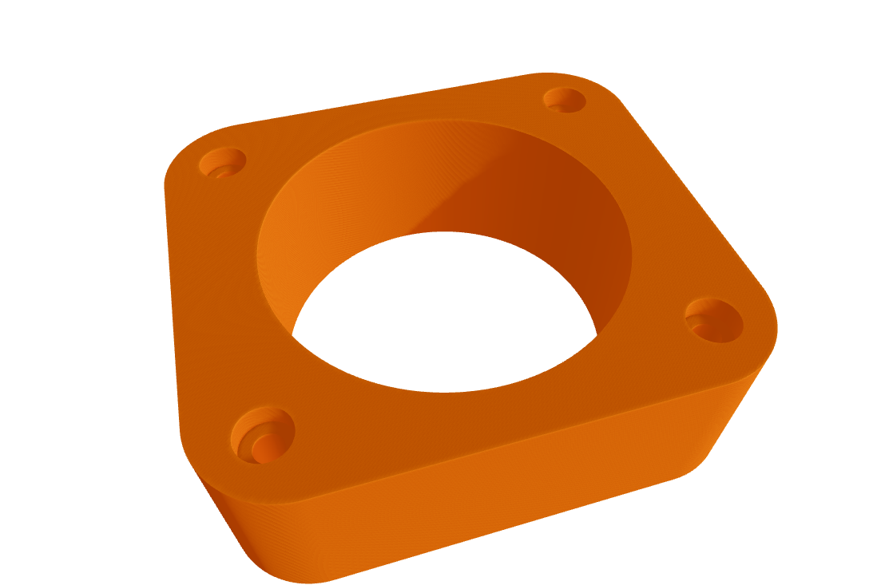

# OpenCascade modelling in Viktor
This innovative application demonstrates the advanced capabilities of constructing intricate 3D models and schematics within Viktor.


The primary objective of this app is to showcase Viktor's proficiency in handling complex geometries alongside those created with its native geometry module. This is accomplished by integrating an open-source Python library, [```CadQuery```](https://cadquery.readthedocs.io/en/latest/index.html), which enables the creation of parametric 3D CAD models and their export in high-quality CAD formats such as STEP, AMF, 3MF, and GLTF.

Key functionalities featured in this app include:
- Advanced parametric 3D modeling
- Enhanced visualization through Viktor's Geometry and Image views

## Parametric pillow block
In this template we will see how to view and edit a parametric pillow block for a standard 608-size ball bearing:

Parameters like height, width and bearing diameter in combination with CadQuery's python bindings for OpenCascade modelling are used in ```generate_assembly()```  to construct a parametric 3D model like so
```Python
# obtain parametrization fields
(length, height, bearing_diam, thickness, padding) = (
    params.length,
    params.height,
    params.bearing_diam,
    params.thickness,
    params.padding,
)

body = (
    cq.Workplane("XY")
    .box(length, height, thickness)
    .faces(">Z")
    .workplane()
    .hole(bearing_diam)
    .faces(">Z")
    .workplane()
    .rect(length - padding, height - padding, forConstruction=True)
    .vertices()
    .cboreHole(2.4, 4.4, 2.1)
    .edges("|Z")
    .fillet(params.fillet)
)
```
The assembly is then exported using one of CadQuery's many export funtions to a format that Viktor's GeometryView can display in ```get_geometry_view()```
```Python
assy, _ = generate_assembly(params)
glb = File()  # temporary file to store 3D model as gltf data
cq.occ_impl.exporters.assembly.exportGLTF(assy, glb.source, True)
return GeometryResult(geometry=glb)
```